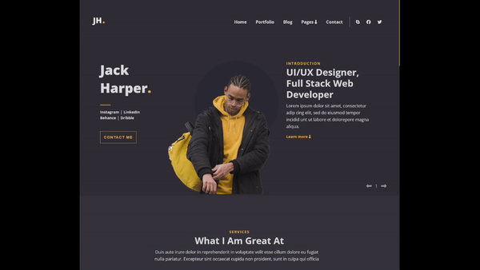
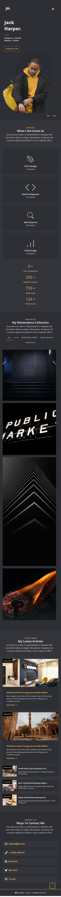

# Portfolio Clone

## Design

  

## Implementation

### Demo - Active States

  
  

  
### Desktop

  

### Tablet

  
  

### Mobile

  
  

### Links

- Live Site URL: [here](https://asmaahamid02.github.io/portfolio-clone/)

## Author

- Website - [Asmaa Hamid](https://linktr.ee/asmaahamid02)
- Frontend Mentor - [@asmaahamid02](https://www.frontendmentor.io/profile/asmaahamid02)
